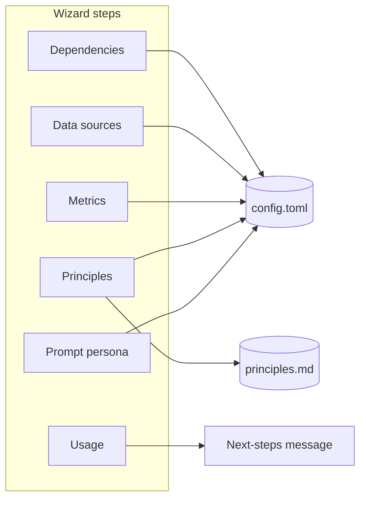

# Terminal Wizard Installer – Build Plan

## Scope

- **Entrypoint**: New CLI command `qi wizard` (or `qi setup`) in [qi/cli.py](qi/cli.py). Optionally make `qi init` call the wizard when run interactively, or keep `qi init` as a minimal bootstrap and have the wizard assume QI home and DB already exist (recommended: wizard runs after `qi init` or creates everything itself like `init` does).
- **Config surface**: [qi/config.py](qi/config.py) – already has `llm_report`, `llm_eod`, `dci`, `dci_metrics`, `snr`, and path helpers. Step 6 requires **new keys** for prompt personalization (see below).
- **Prompt personalization**: [qi/llm/prompts.py](qi/llm/prompts.py) currently uses fixed strings for report (and EOD) system/user prompts. Step 6 will require reading config and assembling prompts from templates or snippets.

## Architecture

- **Single config write at the end** (or per-step): Load config at start (or after `ensure_qi_home`), mutate a dict through the steps, call `save_config` once at the end (or after each step). Use [load_config](qi/config.py) / [save_config](qi/config.py) and clear cache after save so later steps see updated values.
- **Idempotency**: If `config.toml` exists, wizard can offer “Re-run full setup” vs “Skip to step X” or “Only configure missing parts”; at minimum, allow re-running without overwriting unless user confirms.

---

## Step-by-step implementation

### 1. Wizard entry and bootstrap

- **File**: [qi/cli.py](qi/cli.py)
- Add a new Typer command, e.g. `@app.command()` for `wizard()` (or register under a `setup` subcommand).
- In the command:
  - Call `ensure_qi_home()` and, if desired, ensure config and DB exist (either by calling existing `init` logic or by creating config/DB only when missing, like [init](qi/cli.py) does).
  - Load config with `load_config()` and keep a mutable copy for the rest of the wizard (or reload after each step if you prefer).
  - Run the six steps in order; after each step, update the config dict (and optionally call `save_config` for incremental persist).
- Use **Rich** for panels and messages ([Console](qi/cli.py), [Panel](qi/cli.py)) and standard input for choices. Optionally add a small dependency (e.g. `questionary` or `InquirerPy`) for menus; otherwise use `typer.confirm`, `console.input`, and simple loops for menus.

### 2. Step 1 – Dependencies (Ollama + model)

- **Ollama check**: Use [OllamaClient](qi/llm/client.py) with `base_url` from config (default `http://localhost:11434`). Call `check_ready()` (GET `/api/tags`). On failure, print short instructions (install Ollama, start service) and optionally suggest checking PATH for `ollama` and running `ollama serve`.
- **Model list**: Parse `/api/tags` response (JSON with `models` array; each entry has a `name` field) to show a numbered list; user picks by number or types model name. Set `llm_report.model` (and optionally `llm_eod.model` if you want both in wizard).
- **LLM on/off**: Ask “Use LLM for report narratives?”; set `llm_report.enabled` (and optionally `llm_eod.enabled`). If no, skip model selection and document deterministic-only reports.
- **Persistence**: Write `llm_report` (and `llm_eod` if configured) into the config dict; do not write `base_url` unless user explicitly overrides it (e.g. non-local Ollama).

### 3. Step 2 – Data location and optional data sources

- **QI home**: Confirm or prompt for QI home directory (default from [QI_HOME](qi/config.py) / `Path.home() / ".qi"`). If user changes it, note that this normally requires `QI_HOME` env var (config does not store QI_HOME; it’s process-wide). So either: (a) only confirm and show current QI_HOME, or (b) prompt and tell user to set `QI_HOME` and re-run if they want a different path. No config key to add for QI_HOME.
- **Optional data sources**: “Connect or import other data sources now?” Options: (1) SnR QuickCapture – prompt for path, validate with `Path(path).expanduser().exists()`, set `snr.qc_db_path`; (2) “I’ll add later” – leave `snr.qc_db_path` empty; (3) Skip. No new config keys; only `snr.qc_db_path` is used.

### 4. Step 3 – Core metrics and custom metrics

- **Core metrics**: Show current `dci.quick_mode_fields` (default `["energy", "mood", "sleep"]`). Ask “Keep these?” (default Yes). If “Change”, let user add/remove/reorder (e.g. comma-separated list or one-by-one) and write back to `dci.quick_mode_fields`.
- **Custom metrics**: Show current `dci_metrics` from config (structure: each key has `type`, `label`, `aggregate`; see [DEFAULT_CONFIG](qi/config.py)). Offer: “Add custom metric?” (name, type: bool|float|str, label, aggregate: count|rate|sum), “Remove one?”, “Keep as-is”. Update the config dict’s `dci_metrics` accordingly. Validate: key names valid for TOML and for downstream (e.g. no spaces in key).

### 5. Step 4 – Principles and OKRs (ensure file, then LLM vs manual)

- **Ensure file**: Call [ensure_principles_file](qi/config.py)(config); use returned path. If created, user now has [DEFAULT_PRINCIPLES_TEMPLATE](qi/config.py) on disk.
- **Choice**: “How do you want to set up principles and OKRs?” Options: (A) “Generate with LLM” – ask for 1–2 sentence description of goals; call Ollama with a short prompt that asks for principles + 3 KRs in the same markdown format as the template; write result to principles path; then “Open in editor to tweak?” (Y/n) and if yes call same logic as [principles_edit](qi/cli.py) (e.g. `typer.edit(filename=str(principles_path))`). (B) “Edit the file myself” – open editor (same as principles_edit). (C) “Keep template for now” – no LLM, no edit.
- **LLM generation**: Reuse [OllamaClient](qi/llm/client.py) and config (`llm_report` or a dedicated “setup” model). Single generate() call with a system prompt like “You output only markdown: Guiding Principles (## 1. … ) and OKRs / Current Quarter / KR1, KR2, KR3.” and user prompt containing the user’s goal description. Parse response and write to principles path (strip code fences if present).

### 6. Step 5 – How you’ll use QI

- Single question: “How do you plan to use QI?” Menu: (1) Daily check-in only, (2) Check-in + weekly reports, (3) Full pipeline (DCI + import + EOD + reports). No config changes required unless you add a future `usage_profile` key. Print a **next-steps message** based on choice (e.g. “Run `qi dci` daily”; “Run `qi report weekly`”; “Use `qi report weekly --sync` when you have QC configured”).

### 7. Step 6 – System / user prompt (tone, role, strictness, nomenclature)

- **Ask**: “Customize how the AI speaks and works in reports?” (Y/n). If no, skip and keep current hardcoded prompts.
- **If yes**, collect:
  - **Role**: “Primary use: Coach / Journal / Accountability / Reflective analyst.” Map to a short system-persona line.
  - **Tone**: “Tone: Sober and factual / Supportive and warm / Direct and challenging / Neutral.”
  - **Strictness**: “Evidence strictness: Only state what’s in the data / Allow light interpretation / Strict no_data when uncertain.”
  - **Nomenclature**: Optional short list: “Principles” vs “Values”; “OKRs/KRs” vs “Goals”; “Daily Check-In” vs “Journal”; “Win/Friction” vs “Highlight/Blocker”. Store as a small table or dict.
- **Config**: Add a new section or keys under `[llm_report]` (or a new top-level key like `[prompt_preferences]`) so that prompt code can stay in one place. Suggested keys (in config):
  - `prompt_persona` or `role`: e.g. `"coach" | "journal" | "accountability" | "analyst"` (default `"analyst"`).
  - `prompt_tone`: e.g. `"sober" | "supportive" | "direct" | "neutral"`.
  - `prompt_strictness`: e.g. `"strict" | "moderate" | "interpretive"`.
  - `prompt_nomenclature`: dict or inline table, e.g. `principles_label = "Principles"`, `kr_label = "OKRs"`, `dci_label = "Daily Check-In"`, `win_friction = "Win / Friction"`.
- **Prompt builder changes**: In [qi/llm/prompts.py](qi/llm/prompts.py), refactor [build_report_prompts](qi/llm/prompts.py) to accept an optional config dict (or load config inside). Build `system_prompt` and `user_prompt` from:
  - Persona line (e.g. “You are a …” from `prompt_persona`).
  - Tone line (e.g. “Keep it sober. No emojis.” vs “Supportive and warm.”).
  - Strictness line (e.g. “Use only evidence from context…” vs “You may lightly interpret when…”).
  - Nomenclature: substitute terms in the user_prompt task list and in any labels (e.g. “Principles” → config value). Keep JSON schema and structure unchanged; only natural-language text is customized.
- **Backward compatibility**: If new keys are missing, use current hardcoded behavior so existing configs are unchanged.

### 8. Persist config and final message

- After all steps, call `save_config(config)` once (or after each step if you prefer incremental saves). Clear any caches (e.g. `load_config.cache_clear()` is already called inside `save_config`).
- Print a short summary: what was set (e.g. model, QC path, metrics count, principles path, prompt customization on/off) and the chosen “next steps” from step 5.

---

## File and dependency summary

| Item                                         | Action                                                                                                                                                                                                                                   |
| -------------------------------------------- | ---------------------------------------------------------------------------------------------------------------------------------------------------------------------------------------------------------------------------------------- |
| [qi/cli.py](qi/cli.py)                       | Add `wizard()` command; implement steps 1–6 with Rich + typer/console input; call config/principles helpers and optional LLM for principles generation.                                                                                  |
| [qi/config.py](qi/config.py)                 | Add default keys for step 6: e.g. under `llm_report` or new `prompt_preferences`: `prompt_persona`, `prompt_tone`, `prompt_strictness`, `prompt_nomenclature`. Extend `DEFAULT_CONFIG` and merge logic so existing configs get defaults. |
| [qi/llm/prompts.py](qi/llm/prompts.py)       | Refactor `build_report_prompts()` to read config (or receive a config dict), and build system/user prompts from persona, tone, strictness, and nomenclature. Keep schema and task structure; only replace natural-language phrases.      |
| [qi/processing/eod.py](qi/processing/eod.py) | Prefer reading `llm_eod` instead of `"llm"` for consistency with [qi/config.py](qi/config.py) (optional cleanup; config backward compat already maps `llm` → `llm_eod`).                                                                 |
| Optional dependency                          | Add `questionary` or `InquirerPy` in [pyproject.toml](pyproject.toml) for nicer menus; otherwise implement menus with Rich + `console.input()` and if/else.                                                                              |

---

## Testing

- **Unit tests**: Mock `load_config`/`save_config`, OllamaClient, and `typer.edit`; run wizard with predefined answers (e.g. via stdin or by injecting a “answers” list in the wizard function) and assert final config dict and that principles file is created/updated when expected.
- **Integration**: Run `qi wizard` in a temp dir with `QI_HOME` set; choose minimal options (no LLM, skip principles edit); assert `config.toml` and `principles.md` exist and contain expected keys/content.

---

## Order of implementation (suggested)

1. Config: add default keys for prompt preferences and merge in [qi/config.py](qi/config.py).
2. Prompts: refactor [qi/llm/prompts.py](qi/llm/prompts.py) to use config for persona/tone/strictness/nomenclature; preserve behavior when keys missing.
3. CLI: implement `wizard()` in [qi/cli.py](qi/cli.py) with steps 1–5 (no prompt customization yet) and a single `save_config` at the end.
4. CLI: add step 6 (prompt customization) and wire it to the new config keys.
5. CLI: add optional LLM-assisted principles generation in step 4 (reuse OllamaClient + generate).
6. Tests: add tests for wizard (mocked) and for prompt builder with various configs.
7. Optional: update [qi/processing/eod.py](qi/processing/eod.py) to use `llm_eod` and document in README that `qi wizard` is the recommended first-run setup after `qi init` (or that `qi wizard` can replace `qi init` for interactive installs).

